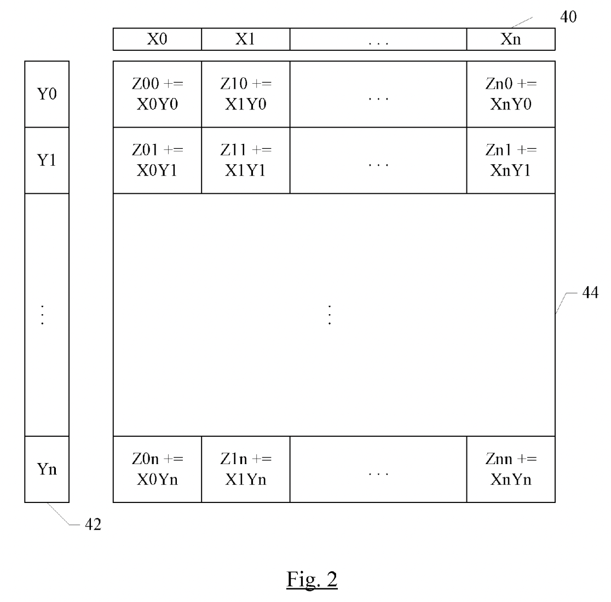

Contemporary M1 / M2 / M3 machines from Apple have (at least) four different ways for low-level programmers to perform heavy computations:
1. Standard ARMv8 SIMD/NEON vector instructions on CPU cores (128 bits wide, issue [up to four per cycle on Firestorm](https://dougallj.github.io/applecpu/firestorm-simd.html))
2. Apple's undocumented AMX instructions, issued from CPU, executed on a special accelerator execution unit
3. The Neural Engine (called ANE or NPU)
4. The GPU (e.g. [Metal Compute Shaders](https://developer.apple.com/documentation/metal/performing_calculations_on_a_gpu))

This repository is all about the 2nd of those: Apple's AMX instructions. Note that these instructions are neither documented nor supported by Apple. As a source of potential great confusion, Apple's AMX instructions are completely distinct from [Intel's AMX instructions](https://en.wikipedia.org/wiki/Advanced_Matrix_Extensions), though both are intended for issuing matrix multiply operations from a CPU.

The research was done on an Apple M1 Max (2021), with follow-up work on an M2 (2023), and additional follow-up work on an M3 (2023). Older or newer chips might have different AMX instructions. [Some sources](https://nod.ai/comparing-apple-m1-with-amx2-m1-with-neon/) report that the M1 contains version 2 of the AMX instructions, which seems plausible (possibly everything using 7-bit writemasks comes from version 1, and everything using 9-bit writemasks is new in version 2). The M1 to M2 transition [adds bf16 support, along with a few other tweaks](https://github.com/corsix/amx/issues/5#issuecomment-1464639729). The M2 to M3 transition [adds one extra mode to each of `ldx` and `ldy` and `matint`](https://github.com/corsix/amx/issues/10).

A good one-image summary of AMX is the following figure from [abandoned patent US20180074824A1](https://patents.google.com/patent/US20180074824A1/en). Consider a 32x32 grid of compute units, where each unit can perform 16-bit multiply-accumulate, or a 2x2 subgrid of units can perform 32-bit multiply-accumulate, or a 4x4 subgrid can perform 64-bit multiply-accumulate. To feed this grid, there is a pool of X registers each containing 32 16-bit elements (or 16 32-bit elements, or 8 64-bit elements) and a pool of Y registers similarly containing 32 16-bit elements (or 16 32-bit elements, or 8 64-bit elements). A single instruction can perform a full outer product: multiply every element of an X register with every element of a Y register, and accumulate with the Z element in the corresponding position.

A single row of the 32x32 grid can also be used to perform vector operations (rather than matrix operations) between X and YT.

In terms of available data types, the general pattern is:
- IEEE754 f16 or f32 or f64 (same width for all three fused-multiply-add operands)
- IEEE754 f16 multiplicands, accumulating onto f32
- On M2 hardware, bf16 multiplicands, accumulating onto bf16 or IEEE754 f32
- Integer 8-bit or 16-bit multiplicands, accumulating onto 16 or 32 bits (in various signednesses)

This repository provides:
- [A tiny header for accessing AMX instructions](aarch64.h) (use at your own risk)
- [A description of the register file](RegisterFile.md)
- [A full description of every instruction](Instructions.md)
- [C code matching the behaviour of every instruction](test.md) (using inline ARMv8 assembly to express certain things)
- [References for further reading](References.md)
