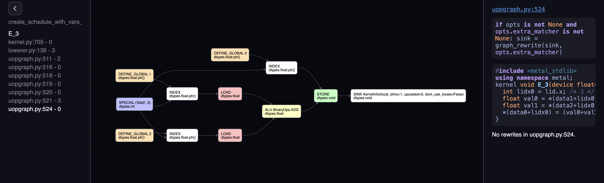
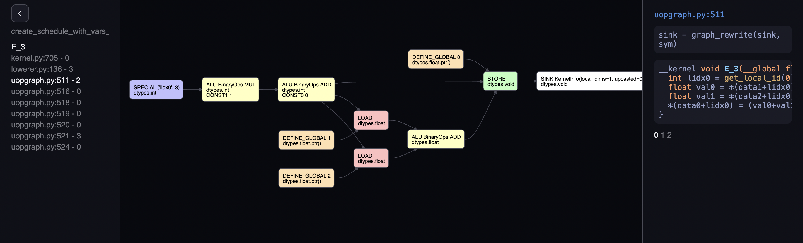
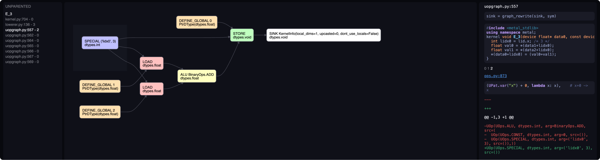

# VIZ

## Background

Tinygrad can express an entire training job <a href="https://github.com/tinygrad/tinygrad/blob/master/examples/stunning_mnist.py" target="_blank">in a single graph</a>.
We use a graph rewrite engine to [break](developer.md#scheduling) this big graph into kernels and [lower](developer.md#lowering) it to <a href="https://github.com/tinygrad/tinygrad/tree/master/tinygrad/renderer" target="_blank">code</a>.

VIZ is a UI for viewing these graph rewrites.


## Quickstart

All you need is run tinygrad with `VIZ=1`! For example, it can show all the graph rewrites for an add kernel:

```py
from tinygrad import Tensor

a = Tensor.empty(3)
b = Tensor.empty(3)
(a + b).realize()
```

The first graph shows we loaded `a` and `b` BUFFERs, used BinaryOps.ADD and stored the result.


The last graph, after applying graph rewrite rules, is functionally equivalent but specialized to how GPUs render code.

See how we're still adding `a` and `b`, but this time using pointers, and the GPU's `SPECIAL` lidx. 



VIZ displays all graph rewrites using 3 parts:

1. Left sidebar kernel list: Groups rewrites by their kernel name. Rewrites from schedule.py don't belong to a kernel so we categorize them as "unparented".
2. Middle UOp graph: DAG visualization of all the nodes.
3. Right sidebar rewrite list: info about what got rewritten.

For example, the third rewrite of kernel E_3 shows 2 graph rewrites. See how the final graph is smaller.




The first rewrite deletes an extra multiply by 1.

The second rewrite deletes an addition by 0.

Applying these ALU simplifications uses less instruction while keeping the same output!

TIP: Use arrow keys left and right to step through the rewrites. [See all keyboard shortcuts](viz.md#keyboard-shortcuts).

You can dive into the tinygrad-specific rewrites next. See how `lowerer.py` replaces ShapeTrackers with actual indexing ALUs.
Or how `schedule.py` rewrites all BUFFER nodes to DEFINE_GLOBAL pointers.


## Keyboard shortcuts

| Key         | Action                             |
|-------------|------------------------------------|
| Arrow Left  | Move forward in the rewrites list  |
| Arrow Right | Move backward in the rewrites list |
| Arrow Up    | Move up in the kernel list         |
| Arrow Down  | Move down in the kernel list       |
| Enter       | Collapse / Expand current kernel   |

The UOp graph moves and zooms using the mouse.
